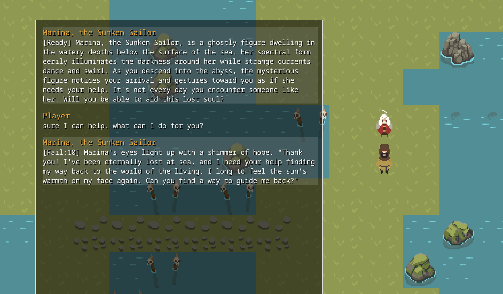

# Endless Quest

```
  ______     __   __     _____     __         ______     ______     ______    
 /\  ___\   /\ "-.\ \   /\  __-.  /\ \       /\  ___\   /\  ___\   /\  ___\   
 \ \  __\   \ \ \-.  \  \ \ \/\ \ \ \ \____  \ \  __\   \ \___  \  \ \___  \  
  \ \_____\  \ \_\\"\_\  \ \____-  \ \_____\  \ \_____\  \/\_____\  \/\_____\ 
   \/_____/   \/_/ \/_/   \/____/   \/_____/   \/_____/   \/_____/   \/_____/ 
      ______     __  __     ______     ______     ______  
     /\  __ \   /\ \/\ \   /\  ___\   /\  ___\   /\__  _\         |v0.1.0 
     \ \ \/\_\  \ \ \_\ \  \ \  __\   \ \___  \  \/_/\ \/         |
      \ \___\_\  \ \_____\  \ \_____\  \/\_____\    \ \_\     _  _|_  _
       \/___/_/   \/_____/   \/_____/   \/_____/     \/_/    |;|_|;|_|;|
                                                             \\.    .  /
                          An infinite multiverse of           \\:  .  /
        \,/               persistent and generative            ||:   |
                          fantastical dream worlds,       \,/  ||:.  |
                /`\       each populated by endless            ||:  .|
                          & thematically consistent            ||:   |
                          fantasy destinations, and   /`\      ||: , |
                          an intruiguing population            ||:   |
                          of strange and marvellous            ||: . |
             _____        beings, all AI generated!           _||_   |
      ____--`     '-~~_                                  __---`   ~`--,__
 ~-~-~                  `~~----__-~,.-`~~--~^~~--.__,--~'      fDm       `~~
```

> What has happened to me? The last thing that I remember, I went to sleep just like any other night.  
> Now I'm here in this strange place, wherever this is. This feels like a dream, but I can't wake up.  
> There are others here too. Deadly beasts, sentient artefacts, devious tricksters, lost souls, and...
> the Lord of this Realm. They all seem bound to this place, but I'm not. I've got to get out of here!  

A love letter to the [Autonomous Worlds Hackaton](https://ethglobal.com/events/autonomous), May 18th to 26th 2023.


## TLDR

*Endless Quest* is an an autonomous world engine for generating infinite, dynamic roleplaying challenges; no two the same. Quest encounters are powered by a sophisticated, behavioural AI storytelling system that ensures narrative and stylistic consistency.

Endless Crawler is used to generate each realm map, with encounters generated and persisted as they are first explored by players. Realms allowing endless re-interpretation of the Endless Crawler chambers across an infinite number of thematically consistent worlds.

## About

*Endless Quest* is an endless, generative roleplaying game, in which you play a traveller lost in the infinite
realms of the dreaming. As you travel through each realm, you will discover infinite unique locations and the
lost souls bound to them; no two alike. Each location and character that you meet in Endless Quest is unique,
and indeed, each of its many realms is generated - in its entirety - dynamically by an AI storyteller.

Each realm generates endless unique locations and characters that are thematically consistent, from one of four
sub-themes and eight different kinds of encounters that are unique to that realm. Locations and characters are
generated once only, the first time that they are discovered, after which they are persisted permanently on-chain.

Once a location has been generated it will remain, however each traveller's visit will be a dynamic, story driven
experience that responds to the player, powered by the AI storyteller.

## Team:

* Mataleone [@rsodre](https://github.com/rsodre)
* Recipromancer [@Rob-Morris](https://github.com/Rob-Morris)
* Mentis [@Mentis123](https://github.com/Mentis123)
* The amazing art of [PixiVan](https://pixivan.itch.io/)


more [screenshots](Assets/screenshots/)


## Made with...

* Lattice [MUD](https://github.com/latticexyz/mud)
* [Endless Crawler](https://endlesscrawler.io/) chambers from mainnet [contracts](https://etherscan.io/address/0x8e70b94c57b0cbc9807c0f58bc251f4cd96acdb0#code)
* [OpenAI API](https://platform.openai.com/docs)
* [wagmi](https://wagmi.sh/)


# Repo Structure


## `AI`

The core of the generative experience is run by two GPT prompts, both detailed in `/AI/Prompts/`:
* [Metadata-Generation.md](https://github.com/funDAOmental/endlessquest/blob/main/AI/Prompts/Metadata-Generation.md) -- Generates the metadata for each world, chamber and encounter
* [NPC-dialog.md](https://github.com/funDAOmental/endlessquest/blob/main/AI/Prompts/Metadata-Generation.md) -- Runs the interaction with each NPC

Art Assets are generated using DALL-E via OpenAI API, as detailed in [GenerativeArt.md](https://github.com/funDAOmental/endlessquest/blob/main/AI/GenerativeArt.md)


## `MUD2`

Old Phaser MUD engine, use MUD3

## `MUD3`

A Phaser MUD engine

### Setting up a local server

Install [Node.js 16+](https://nodejs.org/en/download) (we use version 18)

* Install pnpm

```sh
$ npm install --global pnpm
```

* Install [Foundry](https://github.com/foundry-rs) ([docs](https://book.getfoundry.sh/getting-started/installation))

```sh
$ brew install libusb
$ curl -L https://foundry.paradigm.xyz | bash
# restart the terminal or open a new one
$ foundryup
```

* Do this setup...

Edit `MUD3/env.contracts` if you want to use your own Anvil private key.

```sh
$ cd MUD3
$ pnpm install
$ cp env.contracts packages/contracts/.env
```

### Start local server

```sh
$ pnpm run dev
```

To use a local [sync server](https://github.com/funDAOmental/hyperbox-server), edit `MUD3/packages/client/.env` to contain this, and restart:

```
VITE_SERVER_URL=ws://localhost:8787
```


#### OpenAI API Keys

Your OpenAI API key needs to be stored on cookies.
A `GPT-4` key is preferred, but it also works with `GPT-3`.
The first time the app is loaded on a browser, empty cookies will be created for editing.

| cookie name |value|
|-----|--------|
| `OPENAI_API_KEY` | `sk-xxxxxxxxxxxxxxxx` |
| `OPENAI_ORG_ID`  | `org-xxxxxxxxxxxxxxx` |
| `GPT_MODEL`  | `gpt-4` or `gpt-3.5-turbo` |


## Deployment

### Fund your wallet

* [mud cli faucet](https://mud.dev/cli#faucet)

The wallet used for deployment must have ETH on the network.

```sh
# Lattice testnet
$ pnpm mud faucet --address <address>

# Other networks
$ pnpm mud faucet --faucetUrl <faucetService> --address <address>
```


### MUD deployment

* [mud cli deploy](https://mud.dev/cli#deploy)

Paste the deployment wallet private key to `PRIVATE_KEY` in `MUD3/packages/contracts/.env`

Edit profiles at `MUD3/packages/contracts/foundry.toml`

```sh
# deploy locally (http://localhost:8545)
$ cd MUD3/packages/contracts
$ pnpm mud deploy

# deploy to the lattice testnet
$ cd MUD3/packages/contracts
$ pnpm mud deploy --profile lattice-testnet

# deploy to optimism mainnet
$ cd MUD3/packages/contracts
$ pnpm mud deploy --profile optimism-mainnet
```

If in error and need to retry...

```sh
$ pnpm mud deploy --profile lattice-testnet --priorityFeeMultiplier 5
```


* [Emojimon deployment](https://mud.dev/tutorials/emojimon/deploy-to-testnet#deploy-the-client)


Deploy contracts to testnet...

```sh
$ cd MUD3/packages/contracts
$ pnpm deploy:testnet
> chainid 4242
```

Build distribution...

```sh
$ cd MUD3/packages/client
$ pnpm build
$ zip packages/client/dist
```


## Development notes

### Install a fresh MUD from template

* MUD [getting-started](https://mud.dev/quick-start)

Need Node 18 and Foundry (see above)

```sh
$ npm install -g pnpm
$ pnpm create mud@canary MUD
? Template
> phaser
```


### Upgrade MUD

Check latest version [here](https://www.npmjs.com/package/@latticexyz/cli?activeTab=versions)

```sh
$ cd MUD3
$ pnpm mud:up
```

Or manually...

```sh
$ cd MUD3
$ pnpm mud set-version -v 2.0.0-alpha.1.197
$ cd packages/client
$ pnpm mud set-version -v 2.0.0-alpha.1.197
$ cd -
$ cd packages/contracts
$ pnpm mud set-version -v 2.0.0-alpha.1.197
$ cd -
$ pnpm install
```


